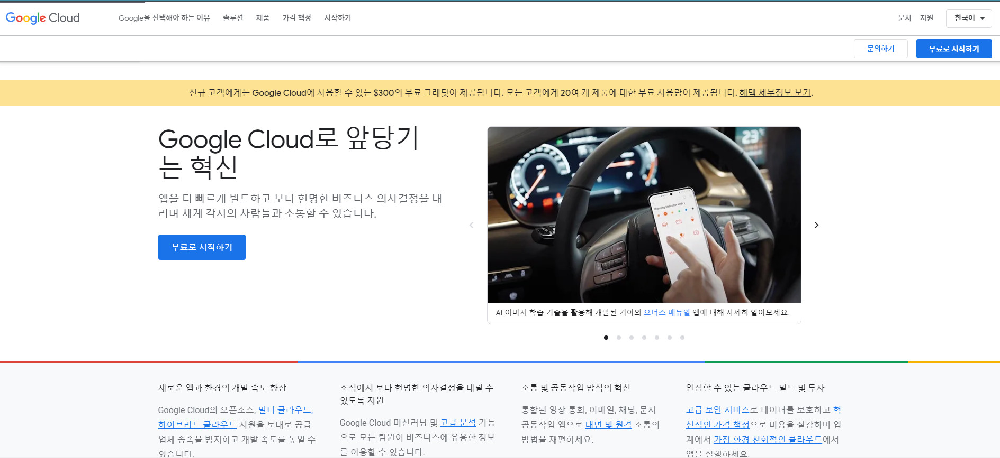

# Google AI로 ML 분석하기

## 유의 사항
- Google AI와 같은 경우 무료계정에서 지원되지 않으니, 실습과정을 지켜보고, 이해만 하시길 바랍니다. 


## AutoML을 이용한 꽃 이미지 분류하기
- 참고 : https://cloud.google.com/vertex-ai


### 프로젝트 및 환경설정

- https://console.cloud.google.com/ 에 접속한다.

- AI 분석을 수행할 프로젝트를 생성 또는 선택한다. 


### 학습데이터 셋 만들기 및 이미지 가져오기


- 본 실습에 사용하는 데이터셋은 https://cloud.google.com/blog/products/gcp/how-to-classify-images-with-tensorflow-using-google-cloud-machine-learning-and-cloud-dataflow 에서 


- 가입절차가 완료 되면, https://console.aws.amazon.com/ 에 접속하여 클라우드 서비스를 둘러 본다.


## EC2에 접속하기

- 자신의 계정의 현재 region 을 확인한다.

- https://console.aws.amazon.com/ 의 서비스에서 EC2 에 접속

- EC2 대시보드 > 인스턴스 접속

- 인스턴스 시작 버튼을 눌러 새로운 인스턴스 시작

- AMI 선택 에서 프리티어가 사용가능한 os 선택 (예- Ubuntu Server 18.04 LTS (HVM), SSD Volume Type)


- t2.micro  type 선택 (반드시 t2.micro로 선택할것)

- 검토 및 시작 클릭

- 인스턴스 시작 및 검토에서 시작하기 클릭

- 새 키 페어 생성 또는 기본 키페어 선택

- 키 페어 다운로드 (다운 받은 키 페어는 잘 보관해 둔다)

- EC2 의 인스턴스 대시보드로 가 생성한 EC2 확인

- 생성한 EC2에 인스턴스를 우클릭후 연결

- SSH 클라이언트 탭 클릭

- SSH 클라이언트 연결

```
ssh -i "cuk.pem" ubuntu@ec2-11-209-61-1.ap-northeast-2.compute.amazonaws.com
```

### 클라우드 환경 실습 (클라우드 자원에서 도커 사용하기)


- apt 패키지 index update
```
sudo apt-get update
```
- 도커 설치를 위한 사전 패키지 설치

```
sudo apt install apt-transport-https ca-certificates curl software-properties-common
```

- 도커 레파지토리 key를 추가

```
curl -fsSL https://download.docker.com/linux/ubuntu/gpg | sudo apt-key add -
```

- 도커 레파지토리 추가

```
sudo add-apt-repository "deb [arch=amd64] https://download.docker.com/linux/ubuntu bionic stable"
```

- apt 패키지 index update
```
sudo apt-get update
```


- docker ce 설치

```
sudo apt install docker-ce
```

- docker 설치가 잘 되었는지 확인

```
sudo docker version
```

- docker 상태 확인

```
sudo systemctl status docker
```


- docker 시작


```
sudo systemctl start docker
```


- docker 종료

```
sudo systemctl stop docker
```


- 인스턴스 사용 종료 후 반드시 해당 인스턴스를 종료 시킬것


## GCP 가입하기

- GCP에 한번도 무료평가판을 사용하지 않은 계정을 이용

- https://cloud.google.com/ 으로 접속


- console로 이동



- 무료 평가판 활성화 시작

- 평가판 활성화를 위한 정보 입력후 평가판 가입 ($300 credits)

### Compute 인스턴스 접속하기

- Compute engine 사용전 ssh키를 먼저 만들어 두어야 한다.

- terminal에서 ssh 만들기

```
ssh-keygen -t rsa -C 'example@example.com'
```

```
Generating public/private rsa key pair.
Enter file in which to save the key (C:\Users\cukuser/.ssh/id_rsa): gcp
Enter passphrase (empty for no passphrase):
Enter same passphrase again:
Your identification has been saved in gcp.
Your public key has been saved in gcp.pub.
The key fingerprint is:
SHA256:Ow63oo75biLpL29cw401zb8enEMNeYS8v22KDkO9O5Y example@example.com
The key's randomart image is:
+---[RSA 3072]----+
|          . ..   |
|           oo    |
|        o  o..   |
|       o o..+    |
|    . + S..o..   |
|     = ...o.o.   |
| .. . o +o *o o  |
|o..=. .+ ooE=. o |
|.oBO=. .o +=..o  |
+----[SHA256]-----+
```


- Compute Engine > VM 인스턴스 접속

- Compute Engine API 사용으로 변경

- VM 인스턴스 만들기

- 만들어둔 public key 등록

- VM 인스턴스 접속

```
ssh -i gcp example@34.64.245.138
```